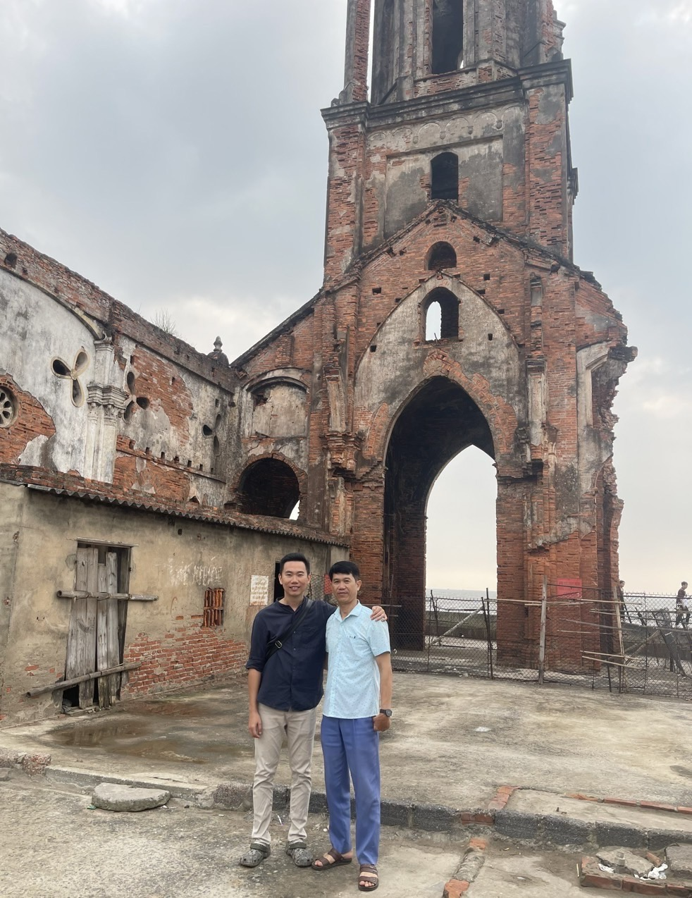

- [[D]]
	- Hôm nay về quê ăn giỗ đầu bà Ngoại. Mẹ cho tiền đi về nên khá thoải mái, mặc dù mình cũng chẳng xài gì ngoài việc đi lại. Đợt này giải ngân khá nhiều nên trước khi đi làm việc cũng căng thẳng lắm.
	- Đám giỗ ở quê năm nay thuê cỗ chứ không tự nấu như trong tưởng tượng của mình. Các món thì như món ăn cơm bình thường, chứ không phải kiểu đãi đám như trong Nam
	- Gặp anh Duẩn và anh Thuỷ. Anh Duẩn khá cởi mở và vui tính. Anh Thuỷ nhiệt tình, chở mình đi thăm thú, ăn sáng 
	-
	-